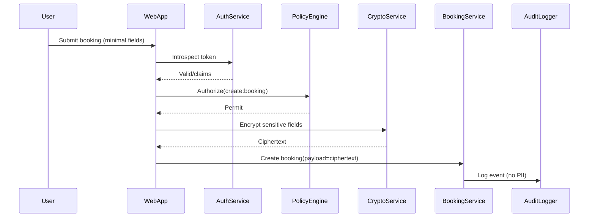
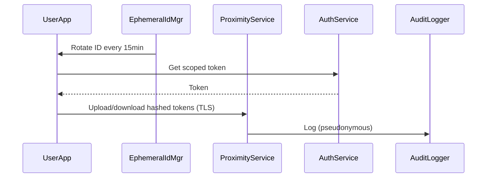
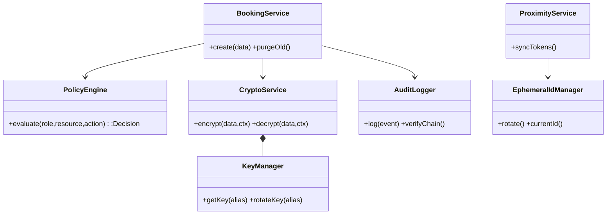

# Privacy-by-Design Home Services App — Personal Report (Group X)
Name/ID: []  Role: []  Repo/PR: []

## Abstract
Focused on privacy-preserving booking and lightweight exposure notification. Proposed 5 security/privacy requirements, provided designs (2 sequence + 1 class), and a minimal executable plan. Evidence-oriented and quick to deliver.

## Overview
- Focused issue: minimize data + avoid linkability in booking/notification
- Responsibility: booking security, authorization, privacy logs
- Team role: authZ/threat modelling for key flows

## I1. Personal Security/Privacy Requirements (≥5)
| ID | Name | Description | Rationale / Security Goals |
|---|---|---|---|
| R01 | Data Minimization in Booking | Only essential fields, optional sensitive defaults off; 30d retention + auto purge. | Purpose limitation; reduce attack surface. |
| R02 | Rotating Pseudonymous IDs | 15-min rotating tokens for exposure; no static identifiers stored/transmitted. | Unlinkability; re-identification mitigation. |
| R03 | Fine-Grained RBAC | Role/resource-scoped permissions; step-up for privileged actions. | Least privilege; confidentiality/integrity. |
| R04 | E2E Encryption & Local Key | AES-GCM in transit/at rest; keys via OS Keychain/Keystore; no raw secrets on server. | Confidentiality; secret hygiene. |
| R05 | Privacy-Preserving Logging | Pseudonymous logs, no PII; hash-chained, rate-limited alerts. | Accountability without leakage. |

Acceptance (examples):
- R01: only whitelisted fields stored; purge job proofs
- R02: token rotates ≤15min; linkability tests fail
- R03: policy tests deny unauthorized actions
- R04: no plaintext secrets; keys from OS store only
- R05: log PII lint=0; hash chain verifiable

## I2. Detailed Design & Modelling (Mermaid)
Mapping: R01→/booking allowlist + /purge retention; R02→/exposure/id + /exposure/sync (EphemeralId); R03→rbac_required decorator (Authorization + X-Role); R04→Fernet encryption in /booking; R05→log_event hash-chain logger







## Implementation & Validation
- Stack: single-file Flask app `app.py` with in-memory store
- Security practices: allowlist in `validate_booking_payload`, RBAC via `rbac_required` (Authorization + X-Role), Fernet encryption in `/booking`, privacy logs without PII via `log_event` hash chain
- How to run:
```bash
cd "/Users/kevin/Desktop/Software Secure Programing/home-services-min"
python3 -m venv .venv
source .venv/bin/activate
pip install -r requirements.txt
# Optional stable key for repeatable runs
export FERNET_KEY=$(python - <<'PY'
from cryptography.fernet import Fernet
print(Fernet.generate_key().decode())
PY
)
python app.py
```
- Demo commands:
```bash
# health
curl -s http://127.0.0.1:5000/health
# create booking (allowed)
curl -s -X POST http://127.0.0.1:5000/booking \
 -H 'Authorization: Bearer demo-token' -H 'X-Role: user' -H 'Content-Type: application/json' \
 -d '{"name":"Alice","service":"plumbing","slot":"2025-10-20T10:00"}'
# create booking (forbidden)
curl -s -X POST http://127.0.0.1:5000/booking \
 -H 'Authorization: Bearer demo-token' -H 'X-Role: provider' -H 'Content-Type: application/json' \
 -d '{"name":"Alice","service":"plumbing","slot":"2025-10-20T10:00"}'
# rotating ID (window default 60s)
curl -s http://127.0.0.1:5000/exposure/id
# sync tokens
curl -s -X POST http://127.0.0.1:5000/exposure/sync -H 'Content-Type: application/json' -d '["a","b"]'
# purge old (admin)
curl -s -X POST http://127.0.0.1:5000/purge -H 'Authorization: Bearer demo-token' -H 'X-Role: admin'
```
- Tests & SAST:
```bash
source .venv/bin/activate
pytest -q            # 3 tests
bandit -r app.py tests -q   # High = 0 (our code)
```

## Results
- Prototype: executable (Flask, local)
- Requirements implemented: R01–R05 (个人范围)
- Unit tests: 3/3 passed (pytest)
- SAST (Bandit): High=0 for our code (`app.py`, `tests`); Low findings only from test asserts
- Evidence: see README commands; curl responses + log hash-chain lines as screenshots

## I3. Reflection
- Learned: traceability from requirements→design→implementation→evidence
- Trade-offs: crypto开销 vs 简化实现；通过最小数据与缓存减轻
- Next: policy更细粒度、增加DAST、可用性测试

## Appendix
- UI截图：booking、exposure（占位）
- PR/Commit IDs（占位）
- Scan/test reports（占位）
- Run instructions snippet（占位）
